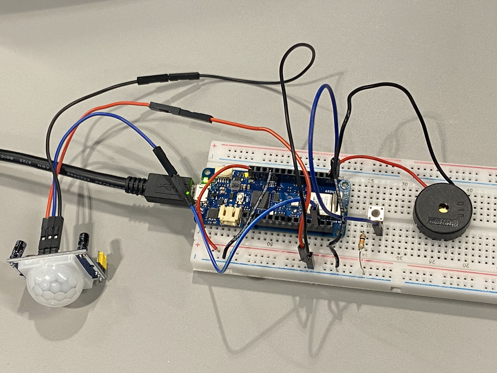

# Intrusion Alarm System
## 0. Project Overview
This Intrusion Alarm System is an Arduino-based project designed to detect unauthorized movements in environments such as labs, offices, or homes. The status of the system will be sent to MQTT server via the Wi-Fi network "CE-Hub-Student", ensuring both on-site and off-site monitoring of activity. This project about MQTT server builds upon [CASA0014 Chrono Lumina workshop](https://workshops.cetools.org/codelabs/CASA0014-L6-chrono-blinker/index.html?index=..%2F..casa0014#1), with sensor added to the system to monitor its surroundings.

## 1. Prototype and System Design 
### Workflow
The following flowchart illustrates the working process of the Intrusion Alarm System:


Before deploying the Intrusion Alarm System, ensure necessary setup and libraries installed.

### Prerequisites  
**Hardware:**  
   + [Arduino MKR WiFi 1010](https://www.bing.com/search?q=Arduino+MKR+WiFi+1010&qs=n&form=QBRE&sp=-1&lq=0&pq=arduino+mkr+wifi+1010&sc=15-21&sk=&cvid=30852ECE31DC40349267C8DCFC9F06D9&ghsh=0&ghacc=0&ghpl=)  
   + [PIR Motion Sensor](https://www.build-electronic-circuits.com/arduino-pir-sensor-circuit-and-code-example/) 
   + [PKM22EPP-40 Buzzer](https://octopart.com/zh/pkm22epp-40-murata-2781524)  
   + Button (for resetting system)  
   + 10kΩ Resistor (for the button's pull-up configuration)  
   + Dupont Wires (for connections) 

**Software:**  
   + Arduino IDE
   + Libraries
     - [`WiFiNINA`](https://docs.arduino.cc/libraries/wifinina/) 
     - [ `PubSubClient` ](https://github.com/knolleary/pubsubclient)
     - [`wifi_drv` ](https://github.com/arduino-libraries/WiFi/blob/master/src/utility/wifi_drv.h)
     - [`arduino_secrets.h`](Intrusion_Alert_System/arduino_secrets.h)

### Process
#### [MQTT Connection Test](MQTT_ChronoLumina_test/MQTT_ChronoLumina_test.ino)
Before integrating the full system, the MQTT connection was tested to ensure that the Arduino could connect to the MQTT broker. This test is based on the [CASA0014 Chrono Lumina workshop](https://workshops.cetools.org/codelabs/CASA0014-L6-chrono-blinker/index.html?index=..%2F..casa0014#1), which outlines how to set up MQTT communication in an Arduino environment.

To connect to a MQTT server, we need to configure some parameters for Wi-Fi and MQTT connections in an Arduino file. It is recommended to create a new head file named "arduino_secrets.h" and add your secret information in it using the following format:
```
#define SECRET_SSID "ssid name"
#define SECRET_PASS "ssid password"
#define SECRET_MQTTUSER "user name - eg student"
#define SECRET_MQTTPASS "password" 
``` 

In this test, the goal was to verify that the Arduino MKR WiFi 1010 can connect to both Wi-Fi and an MQTT server and also send data to MQTT feed, ensuring reliable communication for subsequent integration into the Intrusion Alarm System.
#### [Buzzer and PIR Sensor Test](Alarm_PIR_test/Alarm_PIR_test.ino)
The PIR sensor was used to detect motion in the system's environment, and the buzzer was activated in response to motion detection. The goal was to confirm that the hardware components were functioning correctly before integrating them into the full system.

#### [Intrusion Alert System](Intrusion_Alert_System/Intrusion_Alert_System.ino)
The wiring of this system is showed below:


The entire Intrusion Alarm System was assembled, including:
+ Connecting the Arduino to Wi-Fi and the MQTT server.
+ Continuously monitoring the environment for motion using the PIR sensor.
+ Triggering the buzzer and LED to send alert information based on motion detection.
+ resetting the system with a reset botton
### circuit diagram
Below is the circuit diagram for the Intrusion Alarm System:

## 2. Arduino code analyzing
### Import library and declare variables
```
#include <WiFiNINA.h>   
#include <PubSubClient.h>
#include <utility/wifi_drv.h>
#include "arduino_secrets.h" 

// WiFi and MQTT Configuration
const char* ssid          = SECRET_SSID;       // WiFi network name
const char* password      = SECRET_PASS;       // WiFi password
const char* mqtt_username = SECRET_MQTTUSER;   // MQTT username
const char* mqtt_password = SECRET_MQTTPASS;   // MQTT password
const char* mqtt_server = "mqtt.cetools.org";  // MQTT server address
const int mqtt_port = 1884;                    // MQTT port number
int status = WL_IDLE_STATUS;                   // WiFi connection status

// MQTT and WiFi clients
WiFiClient mkrClient;
PubSubClient client(mkrClient);

// MQTT topic for controlling the lights
char mqtt_topic_demo[] = "student/CASA0014/light/32/pixel/";
const char* brightness_topic = "student/CASA0014/light/32/brightness/";

// PIR and buzzer configuration
const int PIR_PIN = 3;      // PIR motion sensor pin
const int BUZZER_PIN = 7;   // Buzzer pin
const int BUTTON_PIN = 6;   // Reset button pin 
bool pirTriggered = false;  // Tracks if motion has been detected
```
### Function
#### setup()
This function initializes the system by setting up pin modes, starting the WiFi connection, and configuring the MQTT server. It also ensures the system starts in a "safe" state with green lights.

#### loop()
This function continuously monitors the PIR sensor and reset button, ensuring the system's WiFi and MQTT connections remain active. Depending on sensor readings, it triggers alarms, updates lights, and handles system resets.
#### startWifi()
This function connects the Arduino to the specified WiFi network. It retries the connection until successful, ensuring the system is always online.
#### reconnectMQTT()
This function ensures the Arduino reconnects to the MQTT broker if the connection is lost. It uses a unique client ID and retries periodically until the connection is re-established.
#### flashRedLights()
This function flashes the lights red six times and activates the buzzer for alarm signaling. The lights are toggled on and off with delays for a flashing effect.
```
void flashRedLights() {
  for (int i = 0; i < 6; i++) { 
    updateLights(255, 0, 0); // Turn lights red
    tone(BUZZER_PIN, 1000);  // Emit sound
    delay(200);              // Flash delay

    updateLights(0, 0, 0);   // Turn lights off
    noTone(BUZZER_PIN);      // Stop sound
    delay(200);              // Pause before next flash
  }
}

```
#### resetSystem()
This function clears the motion detection flag and resets the lights to green, indicating a safe state.
```
void resetSystem() { 
  Serial.println("Reset button pressed. Lights turning GREEN.");  
  pirTriggered = false;       // Clear motion detection flag 
  updateLights(0, 255, 0);    // Reset light to green 
}
```
#### updateLights(int R, int G, int B)
This function updates the light color for each pixel using the MQTT protocol. It sends an MQTT message with the specified RGB values to control the lights.
```
void updateLights(int R, int G, int B) {
  char mqtt_message[100];
  for (int pixelid = 0; pixelid < 12; pixelid++) {
    sprintf(mqtt_message, "{\"pixelid\": %d, \"R\": %d, \"G\": %d, \"B\": %d, \"W\": 0}", pixelid, R, G, B);
    client.publish(mqtt_topic_demo, mqtt_message); // Publish message to MQTT
  }
}
```
### System Operation Results
Below are the results from the Intrusion Alert System in operation, showcasing its ability to monitor and send alerts via MQTT, as well as the Serial Monitor feedback for debugging purposes.
+ MQTT Feed:
The screenshot below demonstrates the Intrusion Alert System sending motion detection alerts to the MQTT server. This verifies successful data transmission and real-time monitoring capabilities.

+ Serial Monitor Feedback:
The Serial Monitor output confirms the functionality of various components, including Wi-Fi and MQTT connections, PIR sensor readings, and buzzer activations.


## 3. Limitation and Reflection
While the Intrusion Alarm System fulfills its purpose of detecting and alerting unauthorized movements, there are still areas for improvement:

### Limitations:
+ Overly Sensitive Buzzer
The buzzer occasionally triggers false alarms due to excessive sensitivity, making it challenging to balance between effective detection and reducing false positives.

+ Impact of Environmental Vibrations
Small vibrations, such as a knock on the table, can interfere with the accuracy of the PIR sensor, leading to false detections.

### Reflections and Future Improvements:
+ Add an LCD Display
Incorporating an LCD screen into the system can provide real-time information about when an alert was triggered. This addition would give users precise data about intrusion timing, enhancing the system's usability.
+ Encase the System
Creating an enclosed case for the entire system would minimize the impact of external vibrations or environmental factors. A properly designed enclosure could also protect components from dust or accidental damage, improving overall durability and reliability.

These enhancements would make the Intrusion Alarm System more robust and user-friendly, furthering its applicability in real-world scenarios.